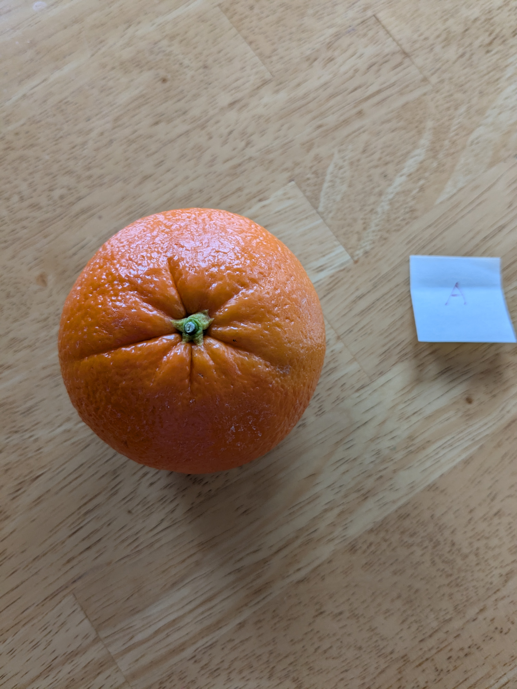

# The **Oranges** dataset

This dataset is part of an ongoing series of experiments at khub.ai. Our goal is to create a Generative‑AI‑based framework that supports a knowledge‑centric industry.

If you’d like additional context, these short articles explain the bigger picture:

- [The Path from LLMs to the Knowledge-Centric Industry](https://www.linkedin.com/posts/kaihuchen_the-path-from-llms-to-the-knowledge-centric-activity-7304518124882579456-bWGc?utm_source=share&utm_medium=member_desktop&rcm=ACoAAAHN2vgBBuFwWduk6vy4GHJTEpTEPOtSKe0)
- [The Knowledge Acquisition Bottleneck in the GenAI Era](https://www.linkedin.com/posts/kaihuchen_the-knowledge-acquisition-bottleneck-in-activity-7309754261846831104-OGbS?utm_source=share&utm_medium=member_desktop&rcm=ACoAAAHN2vgBBuFwWduk6vy4GHJTEpTEPOtSKe0)
- [Improving the Knowledge Bottleneck in GenAI Applications with i3-learning](https://www.linkedin.com/posts/kaihuchen_improving-the-knowledge-bottleneck-in-genai-activity-7311920515034546176-3mXa?utm_source=share&utm_medium=member_desktop&rcm=ACoAAAHN2vgBBuFwWduk6vy4GHJTEpTEPOtSKe0)

Because this is active R&D work, the details on this page may change as we discover better approaches.

## Background

Typically training a model for image classification is a batch process, where it involves collecting suitable images, apply labels to the images, train the model, then repeat the process until satisfactory results are reached.

#### A different approach: inference-time learning with a VLM
Modern vision–language models (VLMs), such as OpenAI's GPT‑4o, are already pretrained on vast image‑text pairs. Out of the box they can do zero‑shot classification: “That’s an orange, that’s an apple, that’s a person …” with no extra training.

Zero‑shot is useful, but sometimes we need the model to draw finer distinctions it has never seen before, and we need it to learn from just one or a few examples, all without retraining or altering the base model.

#### Why this matters
Imagine these real‑time scenarios:

- Reception robot: Seconds before guests arrive, it receives one photo per person and must greet everyone by name.
- Factory robot: Spotting an odd part on the line, gets a quick explanation from an operator, and must handle that part correctly from then on.
- Reconnaissance drone: Sees an unfamiliar object, chats briefly with a human controller, and must immediately recognize and track that object going forward.

Each case demands inference‑time learning: rapid, minimal‑data updates that are auditable, transparent, modular, and portable.

This *Oranges* dataset is our testbed for exploring how to make that happen.

## Recognizing Two Individual Oranges

This dataset supports an experiment in which we ask a **vision–language model (VLM)** to tell **Orange A** from **Orange B** with very few training data. Our goals are to:

- **Learn at inference time:** teach the VLM during use, not through lengthy fine-tuning. This experiment also highlights how inference-time learning can complement batch learning in order to fulfill the specialization needed for a target application goal. 
- **Learning with few data samples:** start with just one example image per orange (and only add a handful more if needed).  
- **User-guided learning:** enable users to inject helpful hints or corrections on the fly during the learning process. This may not be all that important for simple image classification tasks, but it is vital when trying to build complex expert systems. 
- **Knowledge-centric:** ensure everything the model learns is auditable, transparent, modular, and easy to transfer to other systems.

## About the **Oranges** Dataset

Under the **oranges/** folder there are **five sub-folders - A, B, C, D and E**.  
Each folder contains photos of one particular orange, shot from multiple angles, under different lighting and against varied backgrounds.

For **one‑shot learning** experiments there is also a **`oranges/train/`** folder holding only two images:

| File | What it is |
|------|------------|
| **A.jpg** | Exact copy of `oranges/A/A1.jpg` |
| **B.jpg** | Exact copy of `oranges/B/B1.jpg` |

These two pictures form the smallest possible training set for teaching a model to tell **Orange A** from **Orange B**.

#### Why use oranges at all?

- **Representative difficulty** – Distinguishing near‑identical oranges is conceptually similar to recognising specific people, parts on an assembly line, etc.  
- **Convenience** – Oranges were readily available, letting us run a quick feasibility test.  
- **Balanced challenge** – It is hard enough yes still interesting enough to keep the experiment focused.

## How To Test

If you are curious about how to play with this dataset, following is what you would do. You can do these manually by interacting with a VLM chatbot (such as thrugh ChatGPT using OpenAI's GPT-4o model), or alternatively you could also write code using relevant API (e.g., OpenAI's API, or litellm, etc.) to minimize manual work.

#### Two-class test

1. Instruct chatbot to generate a *classification prompt* that can reliably distinguish between the two oranges in the train folder. Also instruct chatbot that in case of making a classification error in the future, then it should revise its *classification prompt*.
2. Instruct chatbot to use the *classification prompt* to classify the images in the A and B folders. Keep a score the classification result.
3. If test score is not satisfactory, then query the chatbot as to why the *classification prompt* did not work out, then go to #1.
4. Ask chatbot to export the *classication prompt* in a way, perhaps with some level of generalization, that is suitable for use in another VLM. 

#### Further directions

If you are ambitious, you can also try the following:

1. Do the same with more classes
2. Do the same with multiple VLM chatbots, testing out whether the *classification prompt* generated on on VLM will work well on another VLM.
3. Do the same with a different dataset other than oranges.
4. Do the same with much more complex tasks beyond simple image classifications, such as:
	a. The visual puzzle of the [ARC-AGI-v2](https://arcprize.org/play?task=16de56c4)
	b. High-level robotic planning by vision, where a robot is able to create a high-level plan about how to accomplish assembly work, interact with human for guidance when needed, and handle exceptional events. (Dataset pending)

